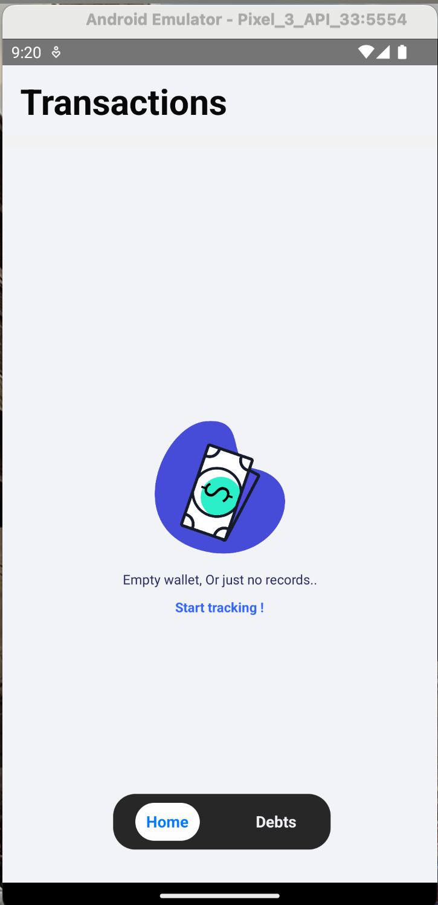
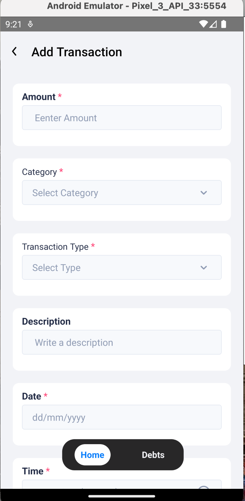
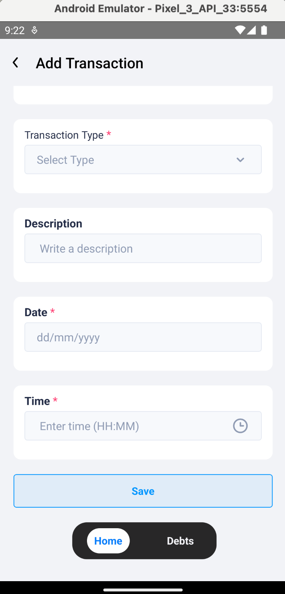
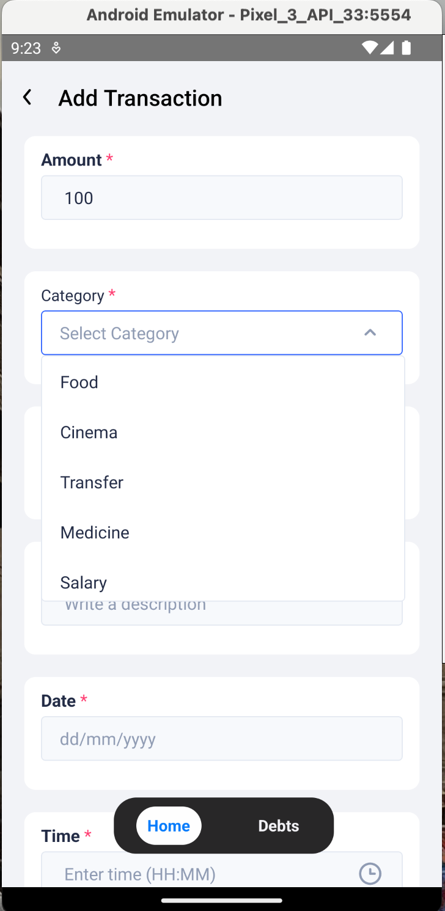
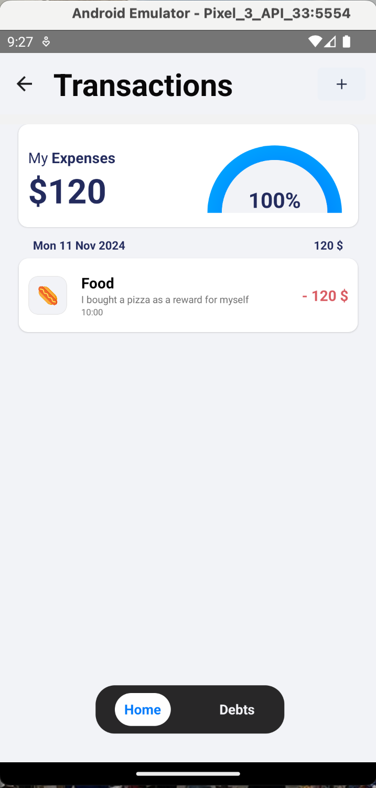
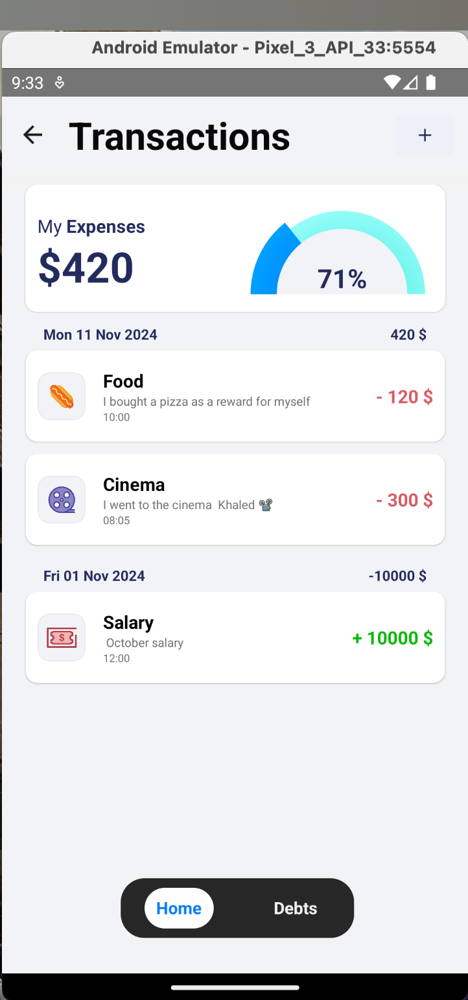
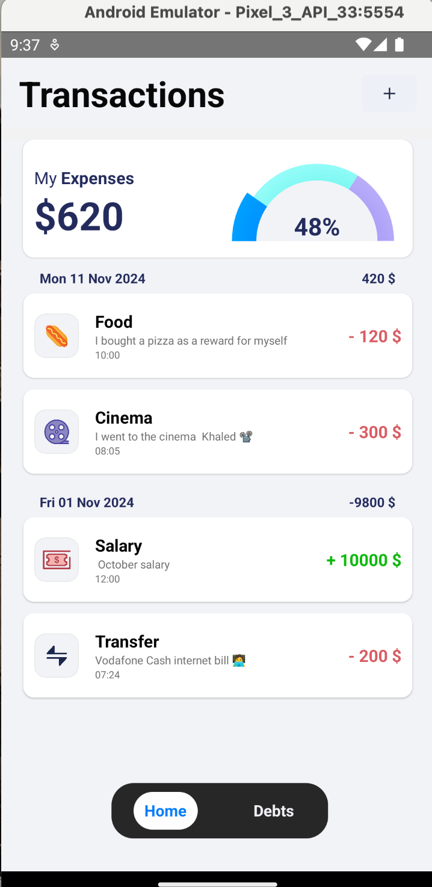

# My-Spending

My-Spending is a React Native app designed to help you track your spending effortlessly. With an intuitive UI, customizable categories, and detailed charts, it enables you to understand where your money goes, track earnings, and stay in control of your finances. This app is perfect for anyone who wants to build better spending habits by recording transactions by date, category, and time, calculating daily and total spending, and identifying the categories with the highest expenditures.

---

## Table of Contents

- [App Journey](#My-Spending-App-Journey)
- [Features](#features)
- [Installation](#installation)
- [Usage](#usage)
- [Folder Structure](#folder-structure)
- [Dependencies](#dependencies)
- [Author](#author)

---

# My-Spending App Journey

This README showcases the journey through the My-Spending app, highlighting key screens and features.

## 1. Home Screen (Empty State)

The home screen shows an empty state when no transactions are recorded yet. This encourages users to start adding their financial data.



## 2. Add Transaction

Here you can add a new transaction, specifying the category, amount, date, discraption, and time.





## 3. Daily Spending

This screen shows a breakdown of your spending for the day.





## Features

- **Add Transactions:** Easily log your spending and earnings by category, date, and time.
- **Daily Spending Summary:** View a calculated summary of all spending in a single day.
- **Total Spending Overview:** Monitor total spending across all transactions.
- **Earnings Tracker:** Track your income to get a complete financial overview.
- **Spending Categories:** Analyze your highest spending categories with insightful charts to help you recognize areas where you spend the most.
- **Beautiful UI:** Enjoy a user-friendly design with appealing visuals to make financial tracking engaging and accessible.

---

## Installation

1. **Clone the Repository:**

   ```bash
   git clone https://github.com/Mhmd3ssam/My-Spending.git
   cd My-Spending
   ```

2. **Install Dependencies:**

   ```bash
   npm install
   ```

3. **Run the App on Android:**

   ```bash
   npm run android
   ```

4. **Run the App on iOS:**

   ```bash
   npm run ios
   ```

---

## Usage

Once launched, you can start adding transactions by specifying the category, date, and amount. My-Spending will show you daily and total spending summaries and provide visual insights into your spending patterns with detailed charts.

---

## Folder Structure

The project structure is organized as follows:
src ├── Helpers # Utility functions ├── Icons # Icons used in the UI ├── Routes # App navigation and routes ├── Screens │ ├── Debts # Screen for managing debts │ └── Transactions # Screen for viewing and adding transactions ├── Shared # Reusable components across the app └── Store # Redux store configuration and slices

Each folder is organized to keep the codebase maintainable, making it easy to navigate and develop new features.

---

## Dependencies

The app utilizes a range of dependencies for enhanced functionality and a smooth user experience:

- **@eva-design/eva:** UI theme and components for a consistent design
- **@react-native-async-storage/async-storage:** Persistent storage for saving user data
- **@reduxjs/toolkit** and **react-redux:** For global state management
- **@react-navigation:** For easy screen navigation
- **date-fns:** For managing date and time operations
- **formik** and **yup:** For form validation and input handling
- **react-native-gifted-charts:** For displaying interactive spending charts
- **react-native-vector-icons:** For custom icons within the app

For a full list of dependencies, check `package.json`.

---

## Author

Developed with ❤️ by Mohamed Essam
